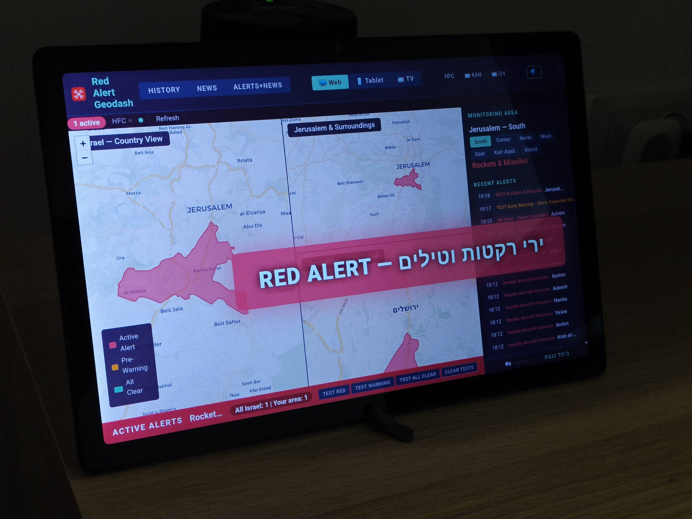
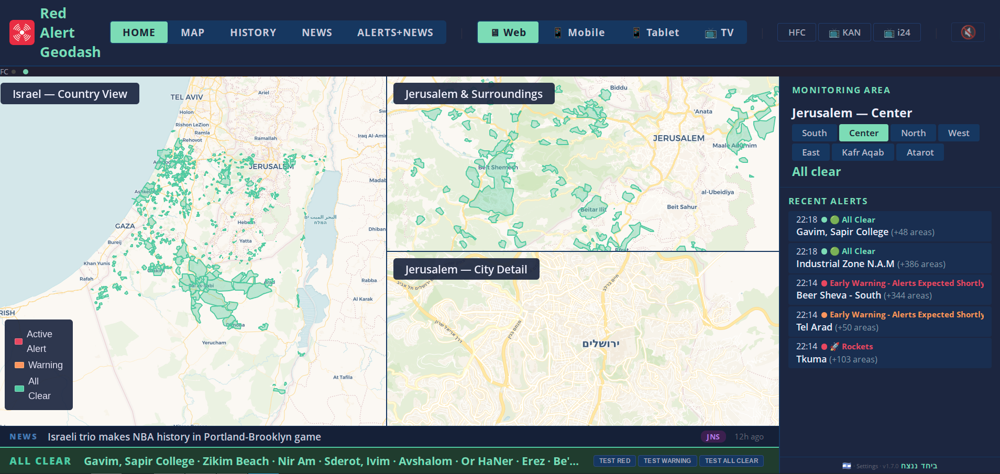
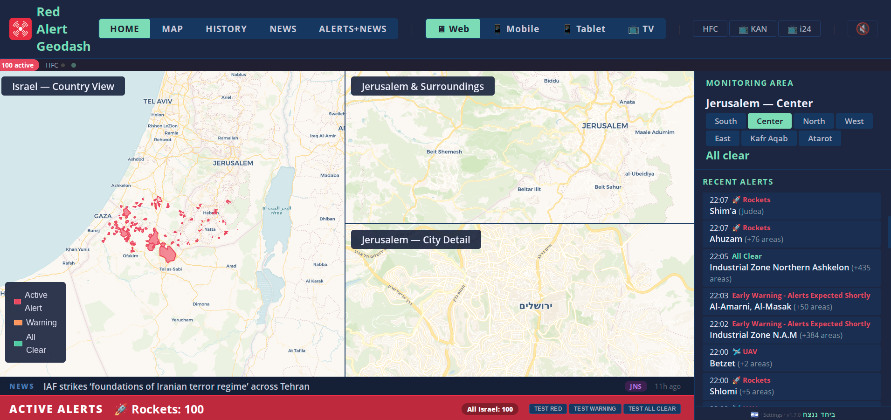
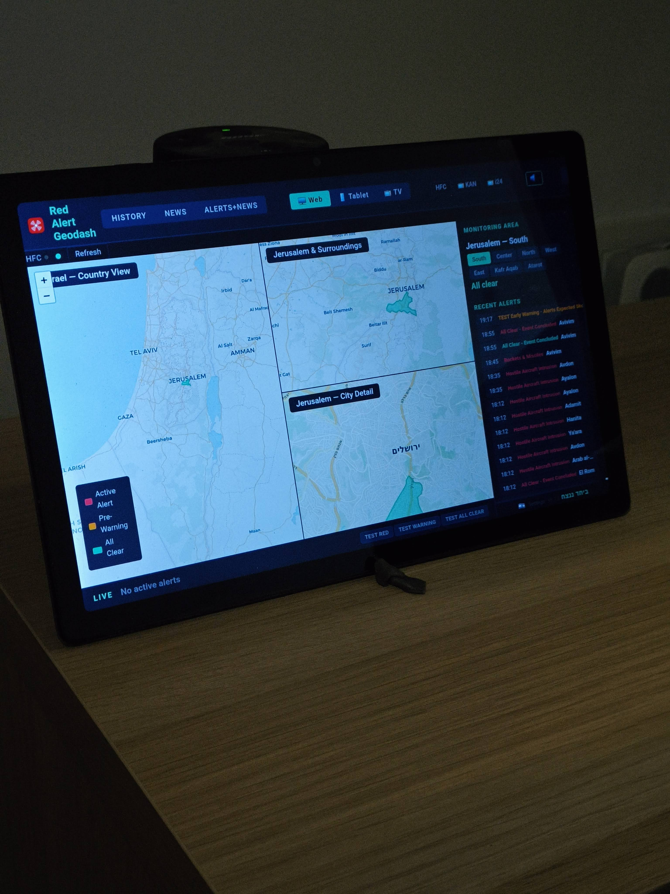

# Red Alert Geodash



Real-time dashboard for Israel's Homefront Command (Pikud HaOref) rocket and situation alerts, displayed on interactive maps with polygon overlays covering 1,450 alert areas.



## Intended Use

This dashboard is designed as an **always-on display** for situational awareness and preparedness. Mount it on a wall-mounted TV, a spare monitor, or a tablet to keep a persistent, at-a-glance view of the security situation across Israel. It is built for households, community security rooms, and anyone who wants passive, real-time awareness of Homefront Command alerts without needing to check their phone.

> **This application only works when hosted from an Israeli IP address.** The Oref alert API is geo-restricted to Israel. The backend must run from an Israeli server or through a proxy with an Israeli exit node.

## Disclaimer

**This is not an official Home Front Command (Pikud HaOref) resource.**

Do not rely on this dashboard as your primary alert or emergency preparedness tool. Always use the official Red Alert app and follow Pikud HaOref instructions. This dashboard is intended to make it easier to visualize what is happening across Israel from the public Red Alert feed, providing a country-level situational awareness view.

The developer assumes no responsibility for missed alerts, incorrect data, or any decisions made based on information displayed by this dashboard. In an emergency, follow official instructions from Pikud HaOref and local authorities.

## Screenshots

### Live Dashboard — All Clear (v2)


### Live Dashboard — Active Alert (v2)


<details>
<summary>Earlier screenshots (v1)</summary>

### Live Dashboard — Active Alert (Red Alert banner with affected areas)
.png)

### Live Dashboard — Multi-Map View (country, Jerusalem surroundings, city detail)
.png)

### Live Dashboard — All Clear Status with Recent Alert History
.png)

### Live Dashboard — Annotated UI (monitoring area, navigation, alert panel)
.png)

### TV Mode — Full-Screen Map with Alert Ticker (Samsung Tizen compatible)
.png)

### TV Mode — Hostile Aircraft Alert with Area Ticker
.png)

### Alerts + News — Combined View (recent alerts with live news feed)


### News Feed — Card Layout with Source Badges
.png)

### Recent Alerts Panel — Detailed Alert Log with Timestamps
.png)

### Mobile/Tablet — Responsive Dashboard with Alert Feed
.png)

### Settings — Monitoring Area and Notification Preferences
.png)

</details>

### Android Tablet — Dashboard (All Clear)


### Android Tablet — Active Red Alert


## Features

- **Live multi-map view** — Country overview, regional, and city-detail maps updating every 3 seconds
- **Polygon overlays** — 1,450 alert areas drawn as colour-coded polygons (red = active threat, orange = pre-warning, green = all clear)
- **Local area monitoring** — Configure your area to receive audio siren and text-to-speech announcements
- **Alert history** — Timeline playback with scrubber showing how alerts evolved through the day
- **News feed** — Aggregated headlines from Times of Israel and JNS
- **TV mode** — Full-screen single map optimised for always-on TV displays (Samsung Tizen compatible)
- **InfluxDB storage** — Time-series persistence for alert history, timeline replay, and latency analytics
- **Test alerts** — Inject test alerts to verify your setup without affecting stored data

## Architecture

```
┌────────────────────┐          ┌──────────────────┐
│   Oref (Pikud      │  ──3s─▶  │  Oref Alert      │
│   HaOref endpoint) │          │  Proxy (8764)    │
│   Geo-restricted   │          │                  │
└────────────────────┘          └────────┬─────────┘
                                         │
                                         ▼
                                ┌──────────────────┐
                                │  This Dashboard  │
                                │  (8083)          │
                                │  FastAPI +       │
                                │  Leaflet + maps  │
                                │  + InfluxDB      │
                                └──────────────────┘
```

- **Alert Source**: [Pikud HaOref Alert Proxy](https://github.com/danielrosehill/Oref-Alert-Proxy) — a lightweight local relay that polls Pikud HaOref every 3s and serves the raw data via HTTP. The dashboard reads from the proxy instead of polling Oref directly. This lets multiple services (dashboards, bots, automations) share a single poller. The dashboard can also fall back to direct Pikud HaOref polling if the proxy is not configured.
- **Backend**: FastAPI (Python 3.12) with background consumer, category classification, and alert persistence logic
- **Database**: InfluxDB 2.7 for time-series alert storage and timeline playback
- **Frontend**: Vanilla HTML/JS with Leaflet maps — no build step required
- **Deployment**: Docker Compose (two containers: app + InfluxDB, plus the proxy)

## Pages

| Page | URL | Description |
|------|-----|-------------|
| Live Dashboard | `/` or `/dashboard` | Main view with multiple map panels |
| History | `/history` | Historical alert timeline with playback scrubber |
| News | `/news` | Aggregated news feed |
| TV Mode | `/tv` | Single full-screen map for TV displays |
| Alerts + News | `/alerts-news` | Combined alert log and news view |
| Settings | `/settings` | Configure monitoring area and notifications |

## Quick Start

### Prerequisites

- Docker and Docker Compose
- Server with an Israeli IP address (required for Oref API access)

### 1. Start the Pikud HaOref Alert Proxy

The dashboard reads alert data from the [Pikud HaOref Alert Proxy](https://github.com/danielrosehill/Oref-Alert-Proxy), a lightweight local relay that handles all Pikud HaOref polling. Start it first:

```bash
git clone https://github.com/danielrosehill/Oref-Alert-Proxy.git
cd Oref-Alert-Proxy
docker compose up -d
```

The proxy will be available at `http://localhost:8764`. Verify it's working:

```bash
curl -s http://localhost:8764/api/status | python3 -m json.tool
```

### 2. Clone and configure the dashboard

```bash
git clone https://github.com/danielrosehill/Red-Alert-Geodash.git
cd Red-Alert-Geodash
```

Copy the example environment file and edit as needed:

```bash
cp .env.example .env
```

Edit `.env` to set your InfluxDB credentials and the proxy URL:

```
OREF_PROXY_URL=http://host.docker.internal:8764
```

### 3. Start the dashboard

```bash
docker compose up --build -d
```

The dashboard will be available at `http://localhost:8083`.

InfluxDB UI is available at `http://localhost:8086` with the credentials you set in `.env`.

> **Note:** If you don't set `OREF_PROXY_URL`, the dashboard falls back to polling Oref directly. The proxy is recommended but not strictly required.

### 4. View logs

```bash
docker compose logs -f geodash
```

## Configuration

### Environment Variables

| Variable | Default | Description |
|----------|---------|-------------|
| `INFLUX_URL` | `http://influxdb:8086` | InfluxDB connection URL |
| `INFLUX_TOKEN` | *(set in .env)* | InfluxDB admin token |
| `INFLUX_ORG` | `geodash` | InfluxDB organisation |
| `INFLUX_BUCKET` | `redalerts` | InfluxDB bucket name |
| `POLL_INTERVAL` | `3` | Seconds between alert polls |
| `OREF_PROXY_URL` | *(empty)* | URL of the [Pikud HaOref Alert Proxy](https://github.com/danielrosehill/Oref-Alert-Proxy). If set, alerts are read from the proxy. If not set, polls Pikud HaOref directly. |

### Monitored Areas

The backend tracks alert status for configurable areas (set in `backend/server.py` under `MONITORED_AREAS`). Defaults:

- Jerusalem South
- Tel Aviv Centre
- Haifa
- Beer Sheva

## Alert Categories

| Category | Colour | Meaning |
|----------|--------|---------|
| 1-4 | Red | Rockets and missiles |
| 7-12 | Red | UAVs, infiltration, earthquakes, tsunamis, hazmat, terror |
| 13 | Green | All clear (event ended) |
| 14 | Orange | Pre-warning |
| 15-28 | — | Drills (ignored by dashboard) |

## API Endpoints

All endpoints return JSON.

| Endpoint | Description |
|----------|-------------|
| `GET /api/alerts` | Current active alerts |
| `GET /api/alerts/enriched` | Alerts with calculated fields (% active, time since last) |
| `GET /api/history` | Today's alert history from Oref |
| `GET /api/polygons` | Area polygon coordinates for map overlays |
| `GET /api/translations` | Hebrew-to-English area name translations |
| `GET /api/alert-log?minutes=60` | Query stored alert events from InfluxDB |
| `GET /api/alert-snapshots?minutes=30` | Query stored snapshots for timeline playback |
| `GET /api/alert-log/stats` | Stats with enriched fields |
| `GET /api/monitored-areas` | Status of configured monitored areas |
| `GET /api/news` | Aggregated news feed |
| `GET /api/health` | Health check |

## Backups

A sample backup script is provided in `scripts/nightly-backup.sh`. It exports alert data from InfluxDB as CSV and uploads to S3-compatible storage. Edit the variables at the top of the script to match your own storage configuration.

## Data Sources & Attribution

### Polygon / Area Data

Area polygon boundaries, centroids, and district mappings are sourced from **[amitfin/oref_alert](https://github.com/amitfin/oref_alert)** by [Amit Finkelstein](https://github.com/amitfin), licensed under the [MIT License](https://github.com/amitfin/oref_alert/blob/main/LICENSE). This is the metadata component of his Home Assistant integration for Israeli Oref Alerts.

Specifically:
- `area_to_polygon.json` — 1,450 area polygon boundaries ([source](https://github.com/amitfin/oref_alert/tree/main/metadata))
- Area info / centroids ([source](https://github.com/amitfin/oref_alert/blob/main/metadata/area_info.py))
- Area-to-district mappings ([source](https://github.com/amitfin/oref_alert/blob/main/metadata/area_to_district.py))

### Alert Data

Live alert data is fetched from the [Pikud HaOref (Israel Homefront Command)](https://www.oref.org.il/) public API. This API is geo-restricted to Israel.

### Maps

Map tiles provided by [OpenStreetMap](https://www.openstreetmap.org/) via [Leaflet](https://leafletjs.com/).

### News Feeds

- [Times of Israel](https://www.timesofisrael.com/) RSS feed
- [JNS](https://www.jns.org/) RSS feed

## Responsible Polling

The Oref alert API is a public government resource. Please poll it responsibly — the default interval of 3 seconds is appropriate for a single household deployment, but if you are running multiple instances or building on top of this project, increase the `POLL_INTERVAL` to reduce load on the Oref servers. There is no need to poll more frequently than every few seconds; alerts persist for their full duration.

## Geo-Restriction

All Oref API endpoints are geo-restricted to Israel. If you deploy this outside Israel, the backend will not receive any alert data. You would need to route API requests through a proxy with an Israeli exit node.

## License

MIT

## Author

Daniel Rosehill ([danielrosehill.com](https://danielrosehill.com))
